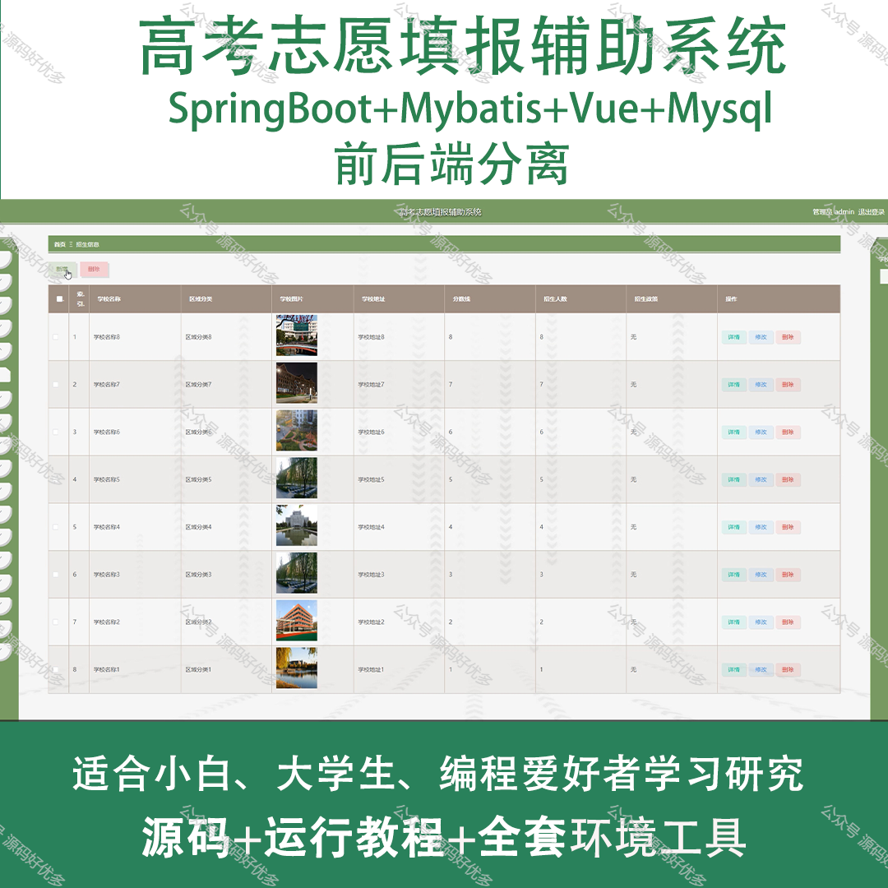
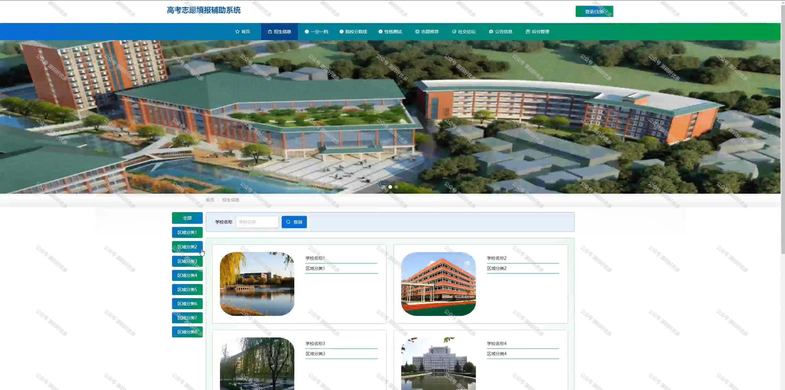
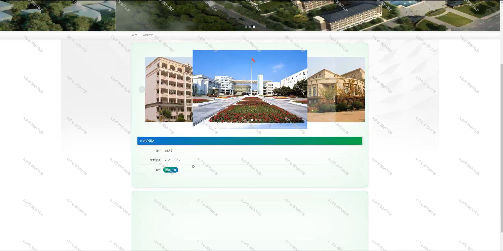
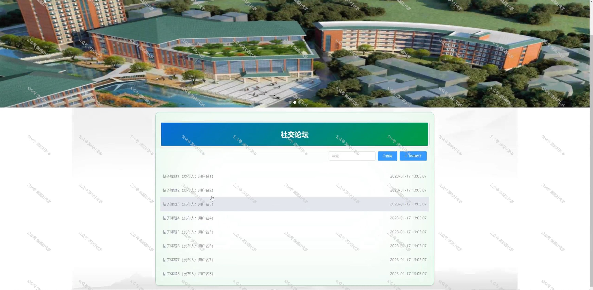
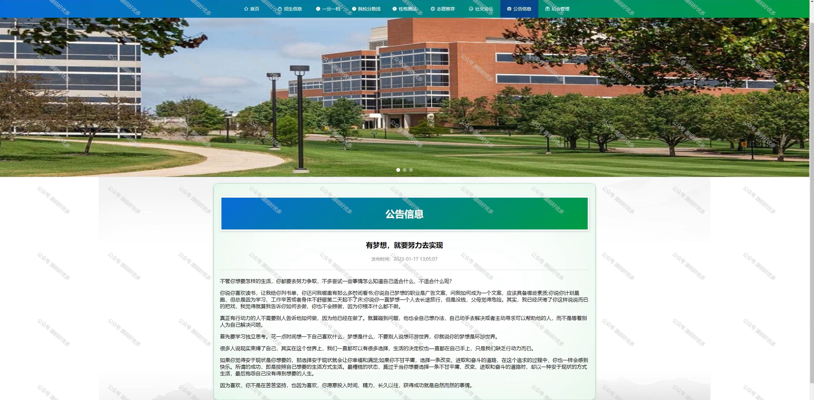
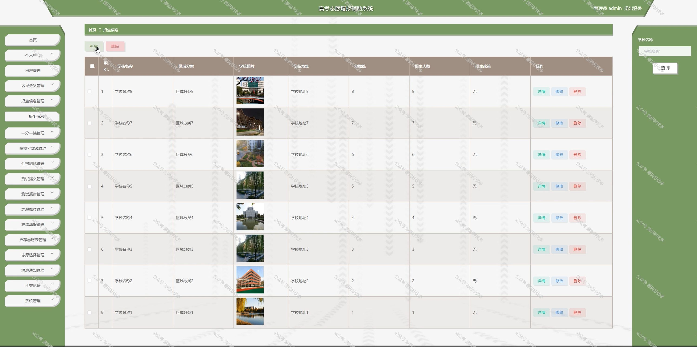
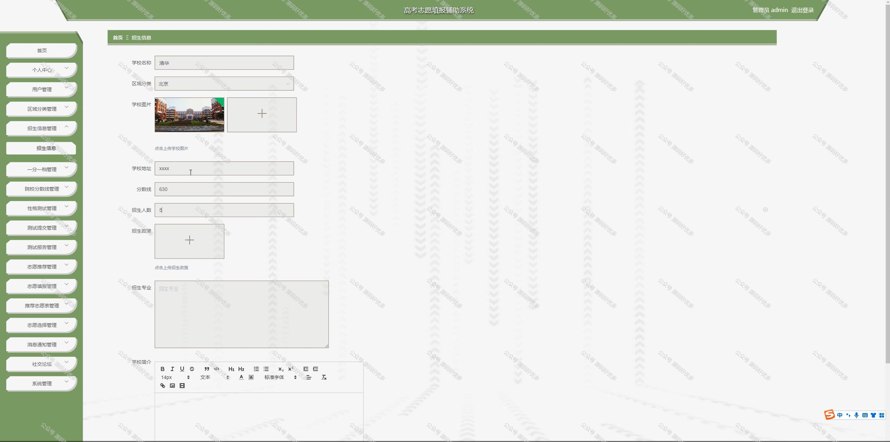
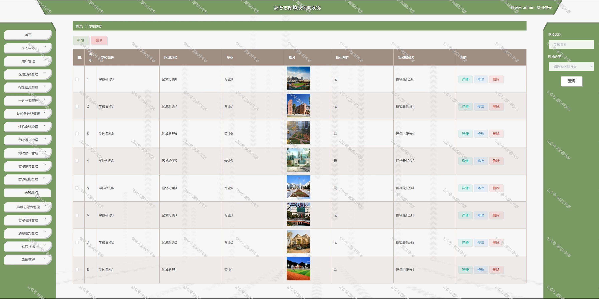

 
## 查看主页获取源码

### 一、作品包含

源码+数据库+全套环境和工具资源+部署教程

### 二、项目技术

前端技术：Html、Css、Js、Vue、Element-ui

数据库：MySQL

后端技术：Java、Spring Boot、MyBatis

  

### 三、运行环境

开发工具：IDEA/eclipse

数据库：MySQL5.7

数据库管理工具：Navicat10以上版本

环境配置软件： JDK1.8+Maven3.6.3

前端Nodejs：14

### 四、项目介绍
项目编号：springbootA154

高考志愿填报辅助系统在每年高考季后应运而生，其背景是为了帮助广大考生和家长在面对复杂多变的志愿填报规则和海量高校信息时，能够更加科学、合理地做出选择。系统通过整合高校数据、专业信息、历年分数线等资源，提供智能推荐、数据分析等服务，旨在减轻考生填报志愿的压力，提高志愿填报的准确性和满意度，助力考生顺利进入理想的大学和专业。

前台用户功能：首页、招生信息、一分一档、院校分数线、性格测试、志愿推荐、社交论坛、公告信息和后台管理、个人中心。

后台分为管理员和用户
管理员的功能：首页、个人中心、用户管理、区域分类管理、招生信息管理、一分一档管理、院校分数线管理、性格测试管理、测试提交管理、测试报告管理、志愿推荐管理、志愿填报管理、推荐志愿者管理、志愿选择管理、消息通知管理、社交论坛、系统管理。

用户的功能：首页、个人中心、测试提交管理、测试报告管理、志愿填报管理、推荐志愿表管理、志愿选择管理、消息通知管理。

### 五、运行截图

  
